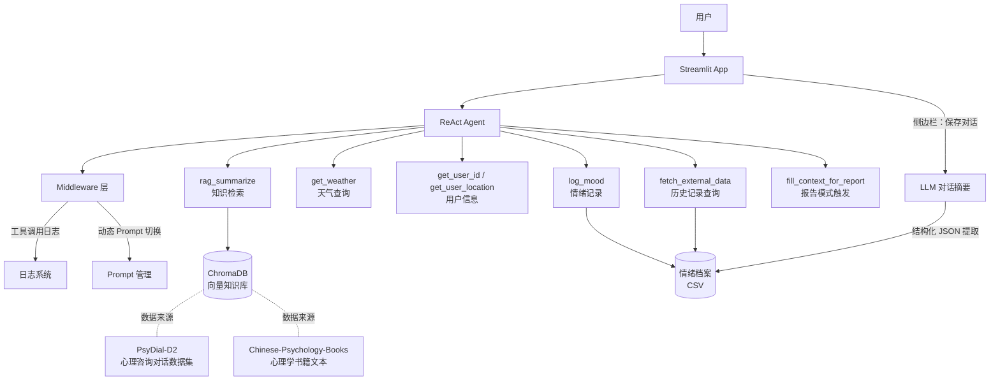

# 🧠 心理健康情感支持助手

基于 **LangChain ReAct Agent** + **RAG** 构建的多工具心理健康对话系统，支持知识检索、情绪记录、月度情绪报告生成。

> ⚠️ 本项目仅供技术学习与情感陪伴参考，**不构成专业心理诊断或治疗建议**。如有严重心理困扰，请及时寻求专业心理咨询师或精神科医生的帮助。

---

## ✨ 项目特性

- **多工具 ReAct Agent**：基于 LangChain 构建，集成知识检索、天气查询、情绪记录、月度报告生成等 8 个工具，通过精确的工具描述与"哨兵工具"机制约束 Agent 的调用顺序
- **垂直领域 RAG 知识库**：使用 ACL 2025 发布的 PsyDial-D2 心理咨询对话数据集与中文心理学书籍文本构建知识库，基于 ChromaDB 实现语义检索
- **自定义 Middleware 层**：通过 `wrap_tool_call`、`dynamic_prompt` 等中间件接口实现工具调用全链路监控与 System Prompt 动态切换，业务逻辑与 Agent 主体解耦
- **情绪数据持久化**：支持 Agent 主动记录情绪，也支持基于大模型对完整对话做结构化摘要（JSON 提取）后自动归档
- **流式对话 UI**：基于 Streamlit 实现，支持多用户切换、历史对话管理、一键保存情绪记录

---

## 🏗️ 系统架构



---

## 📁 项目结构

```
rag_agent/
├── app.py                       # Streamlit 入口，对话界面 + 侧边栏功能
├── main.py                      # 命令行入口
├── build_knowledge_base.py      # 知识库构建脚本（下载数据集 → 写入 ChromaDB）
│
├── agent/
│   ├── react_agent.py           # ReAct Agent 主体，组装工具与中间件
│   └── tools/
│       ├── agent_tools.py       # 业务工具集（RAG检索、情绪记录、报告生成等）
│       └── middleware.py        # 自定义中间件（监控、Prompt动态切换）
│
├── rag/
│   ├── rag_service.py           # RAG 检索 + 摘要链
│   └── vector_store.py          # ChromaDB 向量库读写管理
│
├── model/
│   └── factory.py               # LLM / Embedding 模型初始化
│
├── prompts/
│   ├── main_prompt.txt          # 主对话角色 Prompt
│   ├── rag_summarize.txt        # RAG 检索摘要 Prompt
│   └── report_prompt.txt        # 月度情绪报告生成 Prompt
│
├── config/
│   ├── agent.yml                # Agent 相关配置（数据路径等）
│   ├── chroma.yml                # 向量库路径 / 分块参数
│   ├── rag.yml                   # 模型名称配置
│   └── prompts.yml               # Prompt 文件路径映射
│
├── utils/
│   ├── config_handler.py        # 配置加载
│   ├── logger_handler.py        # 日志工具
│   ├── file_handler.py          # 文件读取工具
│   └── path_tool.py             # 路径处理工具
│
└── data/
    ├── knowledge_base/           # RAG 原始知识文本（构建脚本生成）
    └── external/
        └── records.csv           # 用户情绪历史记录档案
```

---

## 🛠️ 技术栈

| 类别 | 技术 |
|---|---|
| Agent 框架 | LangChain (ReAct Agent) |
| 向量数据库 | ChromaDB |
| LLM / Embedding | Qwen API（可替换为其他兼容 OpenAI 接口的模型）|
| 前端界面 | Streamlit |
| 数据处理 | pandas, datasets (HuggingFace) |

---

## 🚀 快速开始

### 1. 安装依赖

```bash
# 使用 uv（推荐）
uv sync

# 或使用 pip
pip install -r requirements.txt
```

### 2. 配置环境变量

在项目根目录创建 `.env` 文件，填入模型 API Key：

```bash
DASHSCOPE_API_KEY=your_api_key_here
```

### 3. 构建知识库

下载开源数据集并写入向量库（首次运行需要）：

```bash
python build_knowledge_base.py --load
```

该脚本会自动下载以下数据集并完成清洗、分块、向量化：

- [`qiuhuachuan/PsyDial-D2`](https://huggingface.co/datasets/qiuhuachuan/PsyDial-D2)：经隐私脱敏处理的真实心理咨询对话数据集（ACL 2025）
- [`Mxode/Chinese-Psychology-Books`](https://huggingface.co/datasets/Mxode/Chinese-Psychology-Books)：中文心理学书籍文本

### 4. 启动应用

```bash
streamlit run app.py
```

浏览器访问 `http://localhost:8501` 即可开始对话。

---

## 💡 核心设计说明

### 工具调用顺序约束

ReAct Agent 本身不保证多步骤任务的执行顺序。本项目通过两层机制解决这个问题：

1. **精确的工具描述**：每个工具的 `description` 明确说明触发条件、入参格式、出参含义，引导模型按预期顺序调用
2. **哨兵工具 + Middleware 联动**：生成月度报告前，Agent 必须先调用 `fill_context_for_report`，该调用被 Middleware 捕获后会向 runtime context 写入状态标志；下一次模型调用时，`dynamic_prompt` 中间件根据该标志切换为报告专用 Prompt，从而保证"先查询数据，再生成报告"的执行顺序

### 数据持久化的两条路径

用户的情绪数据可以通过两种方式写入档案，两者共享同一套底层写入逻辑：

- **Agent 主动记录**：用户在对话中明确表达记录意愿时，Agent 调用 `log_mood` 工具，自行从上下文中提取情绪评分、标签等信息
- **手动批量总结**：用户点击侧边栏"保存对话"按钮，触发 LLM 对完整对话历史做结构化摘要，以 JSON 格式提取情绪信息后写入

### RAG 知识库构建

数据集经过清洗后转换为适合检索的文本块：心理咨询对话按「来访者-咨询师」问答对切分，保证每个检索单元语义完整；心理学书籍文本按段落切分作为背景知识补充。两类数据共同构成知识库的"专业知识"与"咨询场景"两个维度。

---

## 📌 待优化方向

- [ ] 引入 RAGAS 框架对 RAG 检索质量做量化评估（Faithfulness / Answer Relevancy）
- [ ] `get_weather` 工具目前为模拟数据，计划接入真实天气 API
- [ ] 情绪档案存储从 CSV 迁移至轻量级数据库（如 SQLite），支持并发写入
- [ ] 增加情绪趋势可视化图表

---

## ⚖️ License

本项目仅供学习交流使用。所用开源数据集版权归原作者所有，使用前请遵守对应数据集的开源协议。
