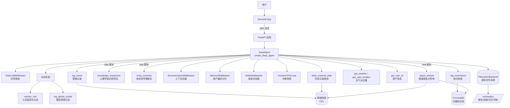

# 🧠 心理健康情感支持助手

基于 **DeepAgents Harness Agent** + **RAG** 构建的多工具心理健康对话系统，支持知识检索、情绪记录、月度情绪报告生成，并具备任务规划、子 Agent 委派、人在回路、自我进化等通用智能体能力。

> ⚠️ 本项目仅供技术学习与情感陪伴参考，**不构成专业心理诊断或治疗建议**。如有严重心理困扰，请及时寻求专业心理咨询师或精神科医生的帮助。

---

## ✨ 项目特性

- **Harness Agent 运行时**：基于 `create_deep_agent` 构建，统一集成任务规划（TodoList）、子 Agent 委派（SubAgents）、人在回路（HumanInTheLoop）、Skills 技能、Memory 记忆、上下文压缩（Summarization）六大能力模块
- **多代理委派**：通过 `task` 工具创建情绪报告分析师、心理学知识研究员、危机信号筛查员三个专职子 Agent，各自独立上下文、仅返回精简结论，支持并行委派
- **任务规划可视化**：模型在多步任务中自主制定并更新任务清单（write_todos），计划进度通过 SSE 事件流实时推送到前端展示
- **人在回路（HITL）**：对"保存情绪记录"等有副作用的写操作配置中断审批，实现"模型主动识别 → 暂停 → 用户批准/拒绝 → 断点恢复"闭环
- **自我进化 Skills**：可复用工作流打包为 Skill（SKILL.md），渐进式披露加载；Agent 运行期可读可写技能文件，自主沉淀新能力
- **垂直领域 RAG 知识库**：使用 ACL 2025 发布的 PsyDial-D2 心理咨询对话数据集与中文心理学书籍文本构建知识库，基于 ChromaDB 实现语义检索
- **情绪数据持久化**：支持 Agent 主动记录情绪（触发人工审批），情绪档案按月分组展示
- **流式对话 UI**：基于 Streamlit 实现，进入先选用户身份，侧边栏展示该用户的历史情绪记录

---

## 🏗️ 系统架构


```mermaid
flowchart TB
    U[用户] --> APP[Streamlit App]
    APP -->|SSE 流式| API[FastAPI 后端]

    API --> AGENT[DeepAgent<br/>create_deep_agent]

    AGENT --> TODO[TodoListMiddleware<br/>任务规划]
    AGENT --> MW[中间件层]
    MW --> MON[monitor_tool<br/>工具监控与日志]
    MW --> LOG[log_before_model<br/>模型调用日志]

    AGENT -->|task 委派| SA1[report_analyst<br/>情绪报告分析师]
    AGENT -->|task 委派| SA2[knowledge_researcher<br/>心理学知识研究员]
    AGENT -->|task 委派| SA3[crisis_screener<br/>危机信号筛查员]

    AGENT --> SUM[SummarizationMiddleware<br/>上下文压缩]
    AGENT --> MEM[MemoryMiddleware<br/>用户偏好记忆]
    AGENT --> SK[SkillsMiddleware<br/>渐进式技能]
    AGENT --> HITL[HumanInTheLoop<br/>中断审批]

    AGENT --> T1[rag_summarize<br/>知识检索]
    AGENT --> T2[get_weather / get_user_location<br/>天气与位置]
    AGENT --> T3[get_user_id<br/>用户信息]
    AGENT --> T4[log_mood<br/>情绪记录]
    AGENT --> T5[fetch_external_data<br/>历史记录查询]

    T1 --> VS[(ChromaDB<br/>向量知识库)]
    T4 --> CSV[(情绪档案<br/>CSV)]
    T5 --> CSV

    AGENT --> FS[(FilesystemBackend<br/>虚拟文件系统)]
    FS --> WS[/workspace<br/>报告/技能/记忆/历史/]

    SA1 --> CSV
    SA1 --> VS
```

---

## 📁 项目结构

```
Mental-Health-Agent/
├── app.py                       # Streamlit 前端：选用户 → 聊天 → 历史记录/审批
├── app/                         # FastAPI 后端
│   ├── main.py                  # FastAPI 入口
│   ├── routers/chat.py          # 对话 / 流式 / 审批恢复 / 历史记录 端点
│   ├── services/chat_service.py # SSE 事件流编排 + 运行时上下文注入
│   └── schemas/                 # 请求 / 响应 Pydantic 模型
│
├── agent/
│   ├── deep_agent.py            # Harness Agent 主体（create_deep_agent）
│   ├── subagents.py             # 三个专职子 Agent 定义
│   ├── context.py               # 运行时上下文 schema（用户身份注入）
│   ├── react_agent.py           # 旧版 ReAct Agent（保留参考）
│   └── tools/
│       ├── agent_tools.py       # 业务工具集（RAG检索、情绪记录等）
│       └── middleware.py        # 自定义中间件（工具监控、日志）
│
├── rag/
│   ├── rag_service.py           # RAG 检索 + 摘要链
│   └── vector_store.py          # ChromaDB 向量库读写管理
│
├── model/factory.py             # LLM / Embedding 模型初始化
├── prompts/                     # 系统 / 报告 Prompt
├── config/                      # yml 配置（模型、向量库、Prompt 路径）
├── utils/                       # 配置加载、日志、路径工具
└── data/
    ├── external/records.csv     # 用户情绪历史记录档案
    └── agent_files/             # 虚拟文件系统工作区
        ├── skills/              # 可复用 Skill（SKILL.md）
        ├── memory/              # 持久化记忆（AGENTS.md）
        └── conversation_history/ # 摘要压缩落盘的对话历史
```

---

## 🛠️ 技术栈

| 类别 | 技术 |
|---|---|
| Agent 框架 | DeepAgents · LangChain · LangGraph |
| 后端 | FastAPI（SSE 流式接口）|
| 向量数据库 | ChromaDB |
| LLM / Embedding | DeepSeek / Qwen API（可替换为兼容 OpenAI 接口的模型）|
| 前端界面 | Streamlit |
| 数据持久化 | CSV（情绪档案）· SQLite Checkpoint（对话状态）|

---

## 🚀 快速开始

### 1. 安装依赖

```bash
# 使用 uv（推荐）
uv sync

# 或使用 pip
pip install -r requirements.txt
```

### 2. 配置环境变量

在项目根目录创建 `.env` 文件，填入模型 API Key：

```bash
DEEPSEEK_API_KEY=your_api_key_here
DASHSCOPE_API_KEY=your_api_key_here
TAVILY_API_KEY=your_api_key_here
```

### 3. 构建知识库

下载开源数据集并写入向量库（首次运行需要）：

```bash
python build_knowledge_base.py --load
```

该脚本会自动下载以下数据集并完成清洗、分块、向量化：

- [`qiuhuachuan/PsyDial-D2`](https://huggingface.co/datasets/qiuhuachuan/PsyDial-D2)：经隐私脱敏处理的真实心理咨询对话数据集（ACL 2025）
- [`Mxode/Chinese-Psychology-Books`](https://huggingface.co/datasets/Mxode/Chinese-Psychology-Books)：中文心理学书籍文本

### 4. 启动应用

先启动 FastAPI 后端（默认端口 8000）：

```bash
cd app
uvicorn main:app --host 0.0.0.0 --port 8000
```

再启动 Streamlit 前端（默认端口 8501）：

```bash
streamlit run app.py
```

浏览器访问 `http://localhost:8501`，选择用户身份后开始对话。

---

## 💡 核心设计说明

### 1. Harness Agent 运行时

系统以 `create_deep_agent` 为底座，把散落的 Agent 能力收敛为一个统一的运行时框架：

- **任务规划**（TodoListMiddleware）：模型在多步任务上用 `write_todos` 工具制定并更新任务清单，维护 pending / in_progress / completed 状态
- **多代理委派**（SubAgents）：报告生成、知识检索、危机筛查等重任务委派给专职子 Agent，每个子 Agent 独立上下文、只回传精简结论，避免主上下文污染
- **人在回路**（HumanInTheLoop）：对有副作用的写操作执行前暂停，等用户审批后再续跑
- **上下文工程**（SummarizationMiddleware + context_schema）：token 达阈值时自动摘要压缩旧消息；运行时注入用户身份，规避工具随机返回用户 ID 的上下文断裂

### 2. AI 主动记录 + 人工审批

用户倾诉情绪后，Agent 会**主动**调用 `log_mood` 工具触发人工介入——前端弹出"是否保存这条情绪记录"的确认框。用户点批准才写入档案，点拒绝则不保存。这套机制让"记录"由 AI 判断、由用户把关，兼顾自动化与安全边界。

### 3. 自我进化 Skills

技能以 `数据/skills/<技能名>/SKILL.md` 为单元，frontmatter 定义 `name` / `description`，正文定义"何时使用 + 工作流 + 输出规范"。采用渐进式披露加载：系统提示先列技能名称与描述，模型按需 `read_file` 读取完整指令。Agent 运行期可用 `write_file` 沉淀新技能，实现能力随使用积累。

### 4. 虚拟文件系统

基于 FilesystemBackend，将文件读写锚定到 `data/agent_files/` 工作区（含 `/skills`、`/memory`、`/conversation_history` 等目录），强制拦截路径穿越，确保 Agent 只能在工作区内读写，不接触项目源代码与 `.env` 等敏感文件。

---

## 📌 待优化方向

- [ ] 引入 RAGAS 框架对 RAG 检索质量做量化评估（Faithfulness / Answer Relevancy）
- [ ] `get_weather` 工具目前为模拟数据，计划接入真实天气 API
- [ ] 情绪档案存储从 CSV 迁移至轻量级数据库（如 SQLite），支持并发写入
- [ ] 增加情绪趋势可视化图表

---

## ⚖️ License

本项目仅供学习交流使用。所用开源数据集版权归原作者所有，使用前请遵守对应数据集的开源协议。
